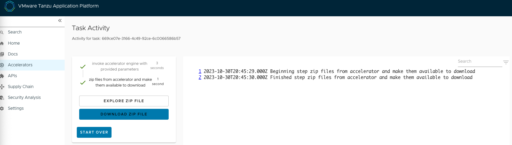

# Session 1 - Tanzu Workload Build
## Initiate Tanzu Workloads with Cloud Native Buildpacks and Kaniko
From the Tanzu Developer Portal, access Accelerators to select the application blueprint. In this exercise we will use ***petclinic***. 


Search for ***petclinic*** and hit choose, leave the deploymentType as 'TAP workload' 


Click Next and Click Generator Accelerator.


Dowload the ZIP File and extract the project. Open it in the IDE of your choice.



### Tanzu Workload Apply with Cloud Native Buildpacks
```
cd ~/Downloads
unzip ~/Downloads/spring-pet-clinic.zip
cd ~/Downloads/spring-pet-clinic
```
```shell
tanzu apps workload apply spring-petclinic \
--build-env BP_JVM_VERSION=17 \
--type web \
--local-path . \
--annotation autoscaling.knative.dev/minScale=1 \
--label app.kubernetes.io/part-of=petclinic \
--label apps.tanzu.vmware.com/has-tests="true" \
--yes
```
```shell
tanzu apps workload tail spring-petclinic --timestamp --since 1h
```
```shell
tanzu apps workload list
```
```shell
tanzu apps workload get spring-petclinic
```
### Tanzu Workload Apply with Kaniko
```shell
tanzu apps workload apply spring-petclinic-kaniko \
--build-env BP_JVM_VERSION=17 \
--type web \
--local-path . \
--annotation autoscaling.knative.dev/minScale=1 \
--label app.kubernetes.io/part-of=petclinic \
--label apps.tanzu.vmware.com/has-tests="true" \
--param dockerfile=./Dockerfile \
--yes
```
```shell
tanzu apps workload tail spring-petclinic-kaniko --timestamp --since 1h
```
### View Image CR - Note latestImage and confirm with image in container in next step
```shell
kubectl get img spring-petclinic -o yaml
```
### View Knative Configuration
```shell
kubectl get config spring-petclinic -o yaml
```
### View build log
```shell
tanzu build-service build list
tanzu build-service build logs spring-petclinic -b 1
```
### View SBOM
Access the Supply Chain plugin and click on the workload


On the Image Scanner step of the SupplyChain - View detected CVEs, Scan Policy, and options to download SBOMs.


> (Optional) setup steps for [Tanzu Insights CLI](https://docs.vmware.com/en/VMware-Tanzu-Application-Platform/1.6/tap/cli-plugins-insight-cli-configuration.html)